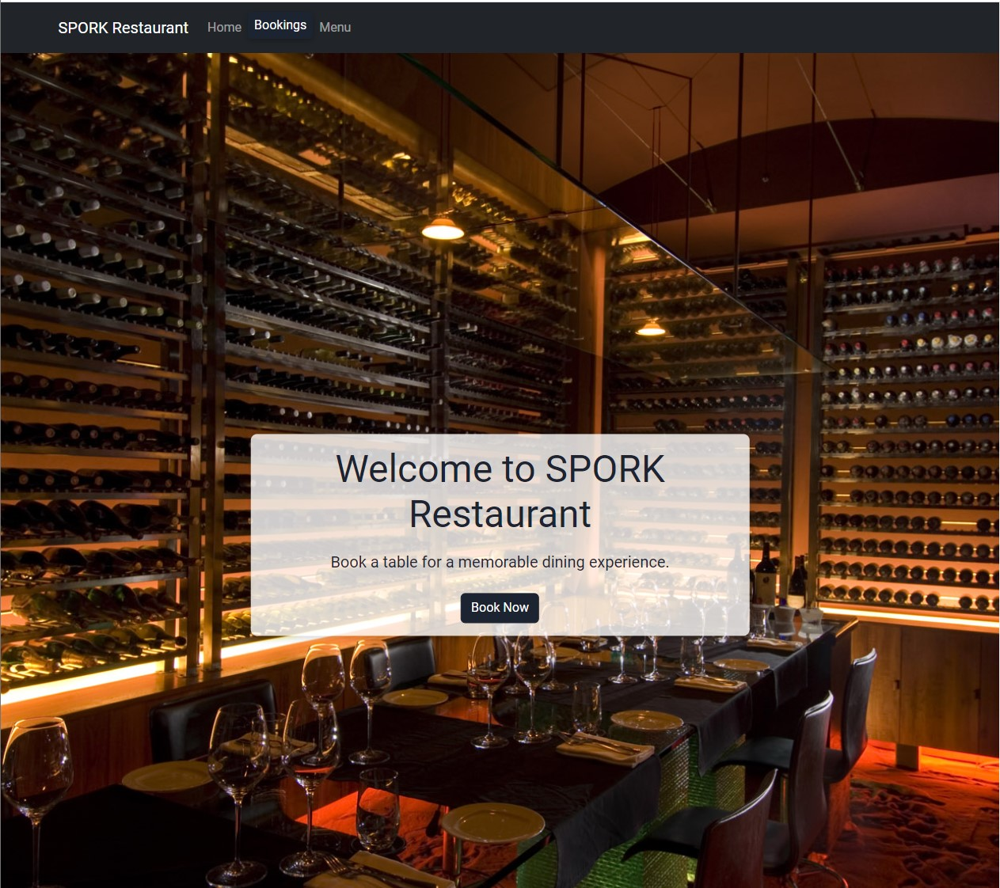

# SPORK Restaurant Booking System

A full-stack web application that allows users to book tables at the SPORK Restaurant.

## Table of Contents

1. [Project Overview](#project-overview)
2. [Installation](#installation)
3. [Usage](#usage)
4. [Features](#features)
5. [Data Schema](#data-schema)
6. [Contributing](#contributing)
7. [License](#license)
8. [Learning Outcomes](#learning-outcomes)

## Project Overview

The SPORK Restaurant Booking System is designed to provide an easy and intuitive way for users to book a table at the restaurant. This application has been developed using Flask, a lightweight Python web framework, with a SQLite database for data storage. The front-end of the application is built using Bootstrap, providing a responsive and accessible user interface.


## Screenshots


*Home page menu, navigation, and hero section*


*Home page bottom with address and dynamic social media icons*


*Social media icons with hover effects*


*Thank you JavaScript dropdown on booking submission*

## Installation

1. Clone this repository:
\```
git clone https://github.com/yourusername/Restaurant-Booking-System.git
\```

2. Navigate to the project directory:
\```
cd Restaurant-Booking-System
\```

3. Create a virtual environment and activate it:
\```
python3 -m venv venv
source venv/bin/activate
\```

4. Install the required dependencies:
\```
pip install -r requirements.txt
\```

5. Set up the Flask environment variables:
\```
export FLASK_APP=main.py
export FLASK_ENV=development
\```

6. Run the application:
\```
flask run
\```

## Usage

After successfully installing and running the application, visit `http://127.0.0.1:5000` in your browser. You can navigate the website using the links provided in the navigation bar.

To book a table, click on the "Book Now" button on the homepage or visit the `/booking` page.

## Features

1. **Responsive Design**: The application is designed to be responsive and accessible, ensuring a seamless user experience across various devices and screen sizes.

2. **Booking System**: Users can book a table by providing their name, email, phone number, date, time, and number of guests.

3. **CRUD Functionality**: The application supports Create, Read, Update, and Delete (CRUD) operations for bookings.

4. **Availability Check**: The system checks the availability of the selected date and time before allowing the user to book a table.

## Data Schema

The data schema for the booking system consists of a single `Booking` model with the following fields:

- `id`: Integer, primary key
- `name`: String, not nullable
- `email`: String, not nullable
- `phone`: String, not nullable
- `date`: Date, not nullable
- `time`: Time, not nullable
- `guests`: Integer, not nullable

## Deployment

This application is deployed on Heroku. You can access the live version here: [https://spork.herokuapp.com/](https://spork.herokuapp.com/)


## Contributing

If you'd like to contribute to this project, please follow these steps:

1. Fork the repository.
2. Create a new branch for your changes.
3. Make your changes and commit them with clear, descriptive commit messages.
4. Push your changes to the remote repository.
5. Create a pull request describing the changes you've made.

## Learning Outcomes

### LO1 - Agile Methodology & Design

We utilized Agile methodology during the planning and design stages of the project. This involved creating user stories and prioritizing features through iterative sprints. Wireframes and mockups were created to guide the development process, ensuring a user-focused design.

### LO2 - Data Model & Application Features

A custom data model was implemented to manage, query, and manipulate booking data in the restaurant domain. CRUD functionality allows users to create, locate, display, edit, and delete booking records.

### LO3 - Authorisation, Authentication & Permissions

Role-based login and registration functionality were implemented to secure access to the application's features. Restricted content is only accessible to authenticated users.

### LO4 - Testing

Manual testing was performed to assess the functionality, usability, responsiveness, and data management of the entire web application. The application was tested on various devices and screen sizes to ensure a consistent user experience.

### LO5 - Version Control with Git & GitHub

The project was developed and maintained using Git and GitHub for version control. Commits were made regularly with descriptive messages to document the development process.

### LO6 - Deployment

The application was deployed to a cloud-based platform, ensuring that the final deployed version matches the development version. Security measures were implemented to protect sensitive information and hide secret keys in environment variables or in .gitignore files.

### LO7 - Object-Based Software Concepts


## License

This project is licensed under the MIT License. For more information, please see the [LICENSE](LICENSE) file.


## Ref 

- hero image https://wall.alphacoders.com/big.php?i=366291
